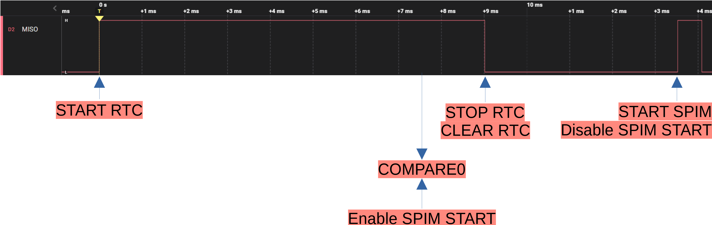

NEC IR Decoder
######

Overview
********
This application will capture NEC IR Encoded frames on MISO_PIN using the nRF52840's SPIM0 peripheral.

The following logical analyzer capture (using a Saleae Logic PRO 8 with the NEC Decoder extension) shows the target nRF52840's SPIM 
starting an SPIM transfer after detecting an NEC IR Start Frame condition (logic high pulse of at least 7.5ms on MISO_PIN), synchronized
to the rising flank of the first information symbol. 

The target nRF52840 also outputs an SCK signal that is used as a trigger source for the logical analyzer capture. 
The SCK signal can be disabled by setting SCK_PIN in main.c to NRFX_SPIM_PIN_NOT_USED.

.. image::  doc/NEC_IR_packet.png

You can open `this <doc/NEC_IR_saleae_capture.sal>`_ capture file with Saleae's Logic 2.x SW if you want to study it further.

The Start Frame is detected by the COMPARE0 event. If an input pulse is shorter than 7.5ms the RTC is stopped and cleared before the COMPARE0 event can enable the SPIM START task.

The following snippet is the terminal output of the application when receiving packets from the companion `NEC IR Encoder application <https://github.com/haakonsh/NEC_IR_Encoder.git>`_: 
::

        *** Booting Zephyr OS build v3.2.99-ncs1 ***
        NEC IR packet received; Address: 240 Data: 103
        NEC IR packet received; Address: 240 Data: 104
        NEC IR packet received; Address: 240 Data: 105
        NEC IR packet received; Address: 240 Data: 106
        NEC IR packet received; Address: 240 Data: 107
        NEC IR packet received; Address: 240 Data: 108
        NEC IR packet received; Address: 240 Data: 109
        NEC IR packet received; Address: 240 Data: 110
        NEC IR packet received; Address: 240 Data: 111
        NEC IR packet received; Address: 240 Data: 112
        NEC IR packet received; Address: 240 Data: 113
        NEC IR packet received; Address: 240 Data: 114
        NEC IR packet received; Address: 240 Data: 115
        NEC IR packet received; Address: 240 Data: 116
        NEC IR packet received; Address: 240 Data: 117
        NEC IR packet received; Address: 240 Data: 118
        NEC IR packet received; Address: 240 Data: 119
        NEC IR packet received; Address: 240 Data: 120
        NEC IR packet received; Address: 240 Data: 121
        [00:00:02.255,920] <inf> cpu_load: Load:4,534%
        NEC IR packet received; Address: 240 Data: 122
        NEC IR packet received; Address: 240 Data: 123
        NEC IR packet received; Address: 240 Data: 124
        NEC IR packet received; Address: 240 Data: 125
        NEC IR packet received; Address: 240 Data: 126
        NEC IR packet received; Address: 240 Data: 127
        NEC IR packet received; Address: 240 Data: 128
        NEC IR packet received; Address: 240 Data: 129
        NEC IR packet received; Address: 240 Data: 130
        NEC IR packet received; Address: 240 Data: 131
        NEC IR packet received; Address: 240 Data: 132
        NEC IR packet received; Address: 240 Data: 133
        NEC IR packet received; Address: 240 Data: 134
        NEC IR packet received; Address: 240 Data: 135
        NEC IR packet received; Address: 240 Data: 136
        NEC IR packet received; Address: 240 Data: 137
        NEC IR packet received; Address: 240 Data: 138
        NEC IR packet received; Address: 240 Data: 139
        NEC IR packet received; Address: 240 Data: 140
        NEC IR packet received; Address: 240 Data: 141
        [00:00:04.256,072] <inf> cpu_load: Load:5,073%
        NEC IR packet received; Address: 240 Data: 142
        NEC IR packet received; Address: 240 Data: 143
        NEC IR packet received; Address: 240 Data: 144
        NEC IR packet received; Address: 240 Data: 145
        NEC IR packet received; Address: 240 Data: 146
        NEC IR packet received; Address: 240 Data: 147
        NEC IR packet received; Address: 240 Data: 148
        NEC IR packet received; Address: 240 Data: 149
        NEC IR packet received; Address: 240 Data: 150
        NEC IR packet received; Address: 240 Data: 151
        NEC IR packet received; Address: 240 Data: 152
        NEC IR packet received; Address: 240 Data: 153
        NEC IR packet received; Address: 240 Data: 154
        NEC IR packet received; Address: 240 Data: 155
        NEC IR packet received; Address: 240 Data: 156
        NEC IR packet received; Address: 240 Data: 157
        NEC IR packet received; Address: 240 Data: 158
        NEC IR packet received; Address: 240 Data: 159
        NEC IR packet received; Address: 240 Data: 160
        NEC IR packet received; Address: 240 Data: 161
        [00:00:06.256,225] <inf> cpu_load: Load:5,102%
        NEC IR packet received; Address: 240 Data: 162
        NEC IR packet received; Address: 240 Data: 163
        NEC IR packet received; Address: 240 Data: 164
        Disconnected

Note that the printk/log module uses the vast majority of the CPU load.
nec_ir_decode() has an average runtime of 366us +/- one LFCLK tick(30.51us), per packet. 
spim_handler() + SPIM ISR uses 1 LFCLK tick per packet. This is measured with SEGGER SystemView

Requirements
************
nRF52840 series device with at least one available SPIM peripheral, one RTC or TIMER peripheral, 2 GPIOTE channels,
, 4 PPI channels, and one PPI cannel group. NCS v2.2.0 SDK or newer. 

Building and Running
********************
Using the nRF Connect for VS Code extension:

Click the '+' button labeled "nRF Connect: Add Folder As Application" in the APPLICATIONS pane.
You will need to hover over the pane beyfore the button row will appear.

Add a build configuration for your nRF52840 device, then build and flash the device. 
Connect your nRF52840 device to an appropriate terminal to view the received data. 

prj.conf has a fair bit of debug options enabled, as well as settings for the FIFO buffer queue. 
Currently the FIFO heap is set to 8kB in order to fit 8 SPIM buffers.

Additional info
***************
Disclaimer:
This application has not undergone extensive testing and there is currently one out-of-spec violation: 
One GPIO can only be assigned to one GPIOTE channel. In this application the MISO pin is assigned to both gpiote_channel_up and gpiote_channel_down.
To comply with the nRF52 spec you need to use 2 GPIOs that are tied together externally and assign them to their respective GPIOTE channel.

The nRF52840 has 16-bit buffer sizes for the SPIM peripheral where the nRF52832 only has 8-bit. Even at the lowest SPI frequencies an NEC IR encoded packet will need ~900 bytes. 
The SPIM's `RXD.LIST <https://infocenter.nordicsemi.com/topic/com.nordic.infocenter.nrf52832.ps.v1.1/spim.html?cp=4_2_0_30_5_11#register.RXD.LIST>`_ register can be used to increase the buffer size to fully capture the whole packet, but it is not implemented.
See `EasyDMA list <https://infocenter.nordicsemi.com/topic/com.nordic.infocenter.nrf52832.ps.v1.1/spim.html?cp=4_2_0_30_1_0#topic>`_ chapter for more information.

`NEC IR protocol appnote from Altium <https://techdocs.altium.com/display/FPGA/NEC%2bInfrared%2bTransmission%2bProtocol>`_.

I recommend the NEC Decoder extension for Saleae Logic 2 if you need to inspect and decode NEC IR packets.